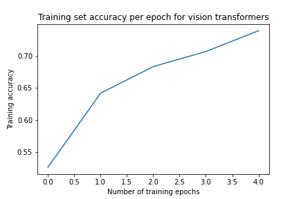
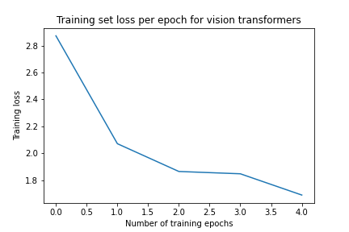
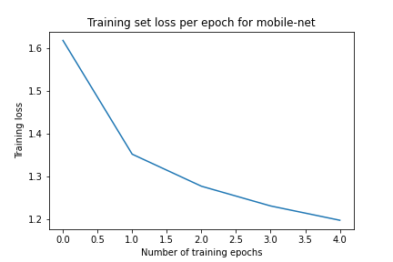
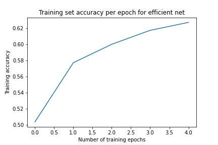
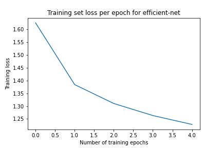
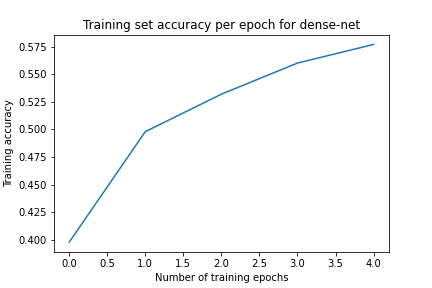
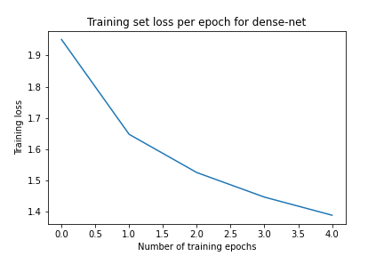
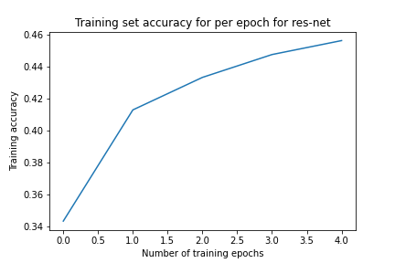
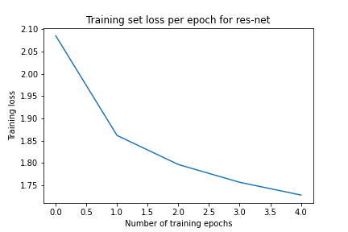

# Document Image Classification on RVL-CDIP

Classifying scanned document images into **16 document types** (letter, form, email, invoice, resume, …) by transfer learning from pretrained CNNs and transformers, combined into a weighted ensemble. This was our entry to the **IndoML Datathon 2022** on Kaggle.

**Best result: 77.0% test accuracy** with a loss-weighted ensemble of EfficientNetV2, MobileNetV2 and MobileViT.

📄 [Project report](docs/report.pdf)

## Dataset

A 16,000-image subset of [RVL-CDIP](https://adamharley.com/rvl-cdip/): grayscale document scans with about 1,000 images per class, plus 900 validation images. It comes from the [Kaggle competition page](https://www.kaggle.com/competitions/datathonindoml-2022/data) and is not included in this repo.

Preprocessing:
- the TIFF images are renamed to JPEG (TensorFlow cannot decode TIFF)
- they are converted to 3-channel RGB and resized to 224 × 224
- they are batched in 32s for mini-batch gradient descent

## Approach

Each backbone is a pretrained model from TensorFlow Hub with a new 16-way softmax layer, fine-tuned with Adam and categorical cross-entropy. Colab's GPU limits restricted most models to 5 epochs.

| Model | Backbone | Train acc | Test acc |
|-------|----------|----------:|---------:|
| ResNet | ResNet-v1-200, supervised contrastive (SupCon) pretraining | 45.6% | 48.6% |
| DenseNet | Small DenseNet trained from scratch (3 dense blocks, growth rate 12) | 57.7% | 24.0% |
| EfficientNet | EfficientNetV2-B0 | 62.7% | 60.6% |
| MobileNet | MobileNetV2 1.3 (224), first 4,000 images | 63.1% | 63.1% |
| MobileNet | MobileNetV2 1.3 (224), full training set | 63.1% | 72.0% |
| Vision Transformer | MobileViT-S | 73.9% | 75.2% |
| **Ensemble by loss** | EfficientNet + MobileNet + MobileViT | – | **77.0%** |
| Ensemble by accuracy | EfficientNet + MobileNet + MobileViT | – | 66.9% |
| Few-shot | Reptile meta-learning (MAML-style), ConvNet | 93.7%* | – |
| LSTM | LSTM over image rows | 6%** | – |

\* Trained only on very small batches; gradients became NaN after a few Reptile iterations.<br>
\** The loss became NaN after the first epoch; there is little sequential structure for an LSTM to use.

**Ensembles.** The class probabilities of the three strongest models are averaged with weights:
- **by loss:** each model is weighted by the inverse of its test loss
- **by accuracy:** each model is weighted in proportion to its test accuracy

### Training curves

| | Accuracy | Loss |
|---|---|---|
| **MobileViT** |  |  |
| **MobileNetV2** |  |  |
| **EfficientNetV2** |  |  |
| **DenseNet** |  |  |
| **ResNet** |  |  |

## Repository layout

```
notebooks/
  MobileNet.ipynb          MobileNetV2 pipeline end to end, with explanations
  MobileNet2.ipynb         MobileNetV2 trained on the full training set
  MobileNetTesting.ipynb   comparison of MobileNet v1/v2 variants
  ResNet.ipynb             ResNet-v1-200 (SupCon)
  DenseNet.ipynb           DenseNet built and trained from scratch
  VisionTransformer.ipynb  MobileViT-S
  Ensemble.ipynb           weighted ensembles of saved predictions
  FewShot.ipynb            Reptile few-shot learning (+ ensemble code)
  LSTM.ipynb               LSTM experiment
predictions/
  final_submit_approx_predicted_label_*.csv   class probabilities per model
  ensemble_*.csv                               ensemble probabilities
  kaggle-indoml-submission.csv                 submitted labels
images/       training accuracy (_a) and loss (_l) plots
docs/         report.pdf, requirements.pdf (library versions)
```

The EfficientNet training notebook is not included; its results are from the report.

## Running the notebooks

The notebooks were written for **Google Colab** with a GPU runtime:

1. Download the dataset zip from the [competition page](https://www.kaggle.com/competitions/datathonindoml-2022/data) and upload it to a `Datathon` folder in your Google Drive.
2. Open a notebook in Colab, mount Drive, and run the first cell to unzip the data. It produces `training/`, `validation/`, `train_labels.csv` and `sample_submission.csv`.
3. Run the remaining cells.

Library versions: TensorFlow 2.8.2, TensorFlow Hub 0.12.0, Keras 2.10.0, NumPy 1.21.6, pandas 1.3.5, scikit-learn, Matplotlib (see [`docs/requirements.pdf`](docs/requirements.pdf)).

## Team

Archit Mangrulkar · Ashish Rekhani · Raj Shekhar Vaghela · Devendra Palod · Deepiha S

Indian Institute of Technology Kharagpur, IndoML Datathon 2022.
